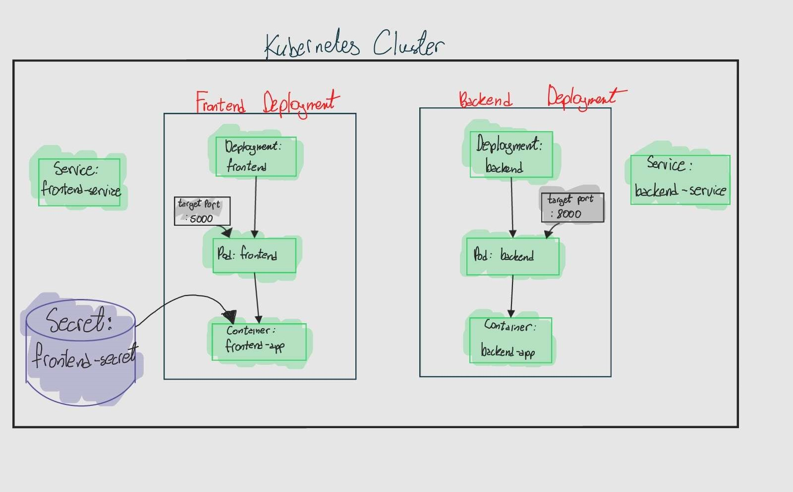
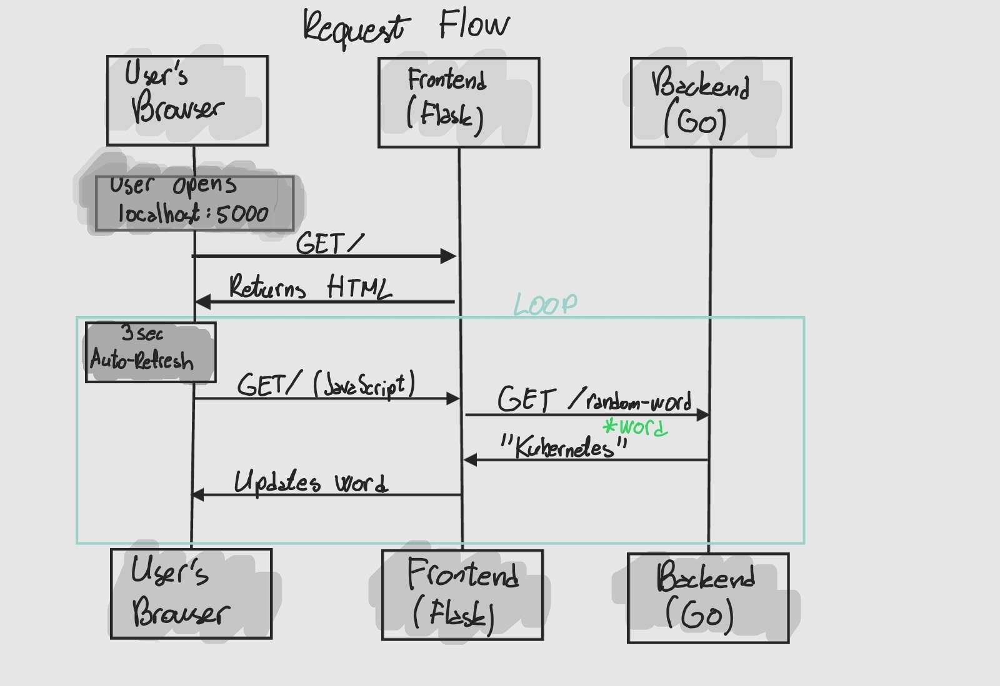

# Sistemske prakse 2025


## Task 1: Dockerization

backend/**backend.Dockerfile**

frontend/**frontend.Dockerfile**

## Task 2: Kubernetes

### Key Components

- **Pods**  (Container instances)
  - Backend - serves API at :8000
  - Frontend - serves webpage at :5000
- **Services** (Networking) 
  - _backend-service.yaml_
  - _frontend-service.yaml_
- **Deployments**
  - _frontend-deployment.yaml_
  - _backend-deployment.yaml_
- Secret
  - _frontend-secret.yaml_

## Kubernetes Resource Structure Diagram



## Request Flow Diagram



## Deployment Steps

```bash
minikube start
```
```bash
# Set Docker to use Minikube's daemon 

eval $(minikube docker-env)

# Build images
docker build -t backend-app -f backend/backend.Dockerfile backend/
docker build -t frontend-app -f frontend/frontend.Dockerfile frontend/
```

```bash
# go to the directory with yaml files
cd myapp/templates
# apply the templates
kubectl apply -f templates/
```

```bash
# Start tunnel in new terminal (helps if run as Admin)
minikube tunnel
# Get frontend URL
minikube service frontend-service --url
# Open the URL in browser
# or alternatively open this IP-PORT:
127.0.0.1:5000
```

```bash
# Some Verification Commands
kubectl get pods
kubectl get services
kubectl describe pod frontend-___
```